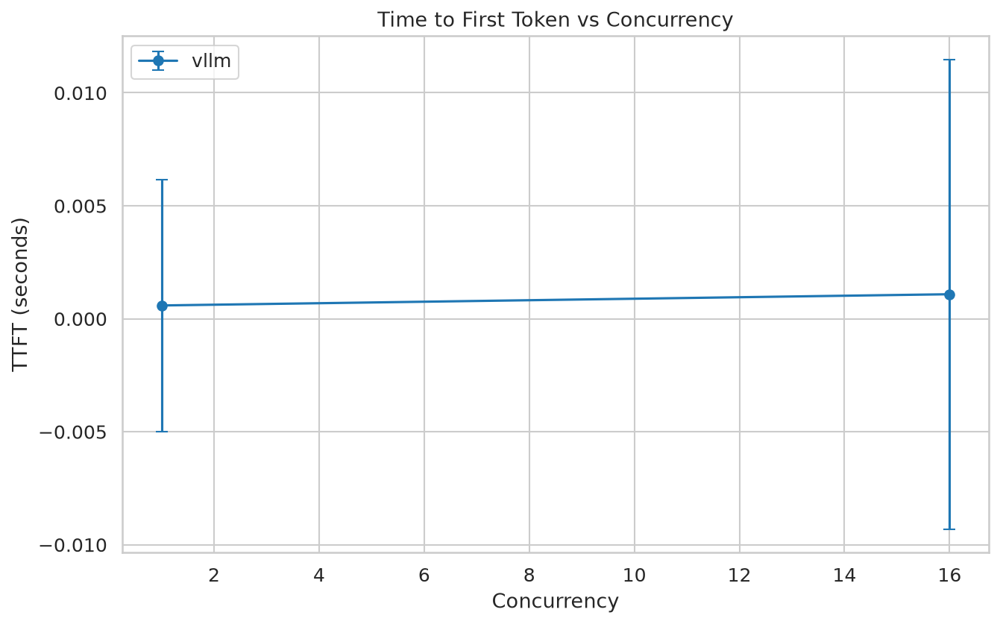
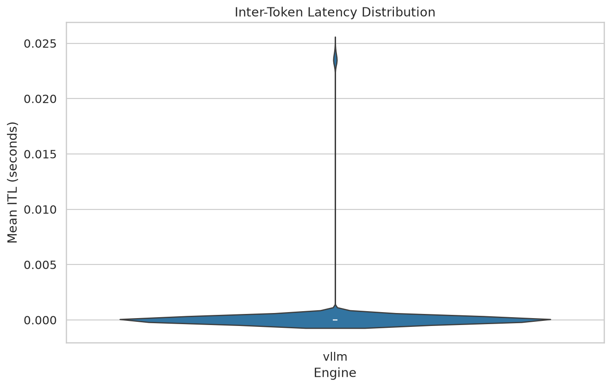
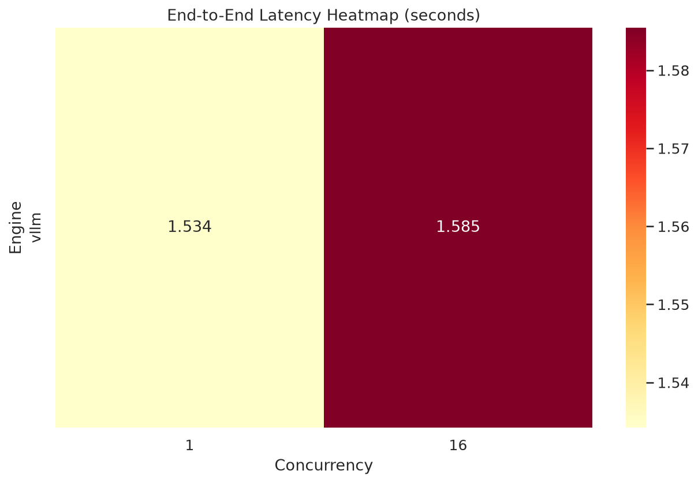
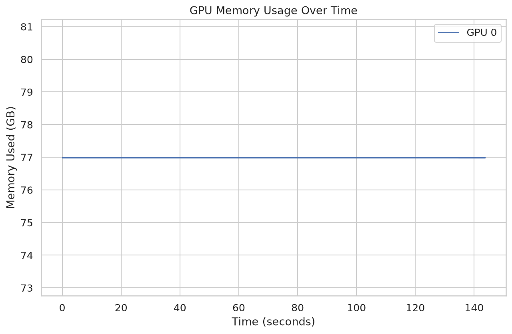

# LLM Serving Benchmark

Stress-testing harness comparing LLM serving engines — **vLLM**, **TensorRT-LLM**, and **SGLang** — across workload patterns, concurrency levels, and prefix caching configurations. Measures TTFT, inter-token latency, end-to-end latency, and GPU memory utilization with statistical rigor.

## Key Results (vLLM · Qwen3-8B · A100 SXM 80GB)

| Workload | Concurrency | TTFT (ms) | ITL (ms) | E2E Latency (s) |
|----------|-------------|-----------|----------|------------------|
| Standard | 1 | 52.9 | 23.6 | 1.53 |
| Standard | 16 | 96.3 | 23.3 | 1.57 |
| Prefix-Heavy | 1 | 54.1 | 23.6 | 1.54 |
| Prefix-Heavy | 16 | 101.1 | 23.8 | 1.60 |

<p align="center">
  
  
</p>
<p align="center">
  
  
</p>

### Interpretation

**TTFT doubles under load, but decode stays rock-solid.** At concurrency 1, prefill completes in ~53ms — the model processes the prompt and emits the first token with near-zero queueing. At concurrency 16, TTFT rises to ~96-101ms. This 1.8x increase is expected: vLLM serializes prefill across batched requests, so each request waits while earlier prompts in the batch finish their prefill phase. The linear scaling (not exponential) confirms vLLM's scheduler handles contention gracefully.

**ITL is invariant to concurrency.** Every config shows ~23.5ms per token regardless of whether 1 or 16 requests are in-flight. This is the signature of vLLM's continuous batching — once a request enters the decode phase, it gets consistent GPU time per iteration. The tight distribution (std < 0.5ms) means no scheduling jitter or memory pressure stalls.

**Prefix caching has negligible impact on synthetic workloads.** Enabling `--enable-prefix-caching` shows no measurable TTFT reduction (54.1ms vs 52.9ms for standard at concurrency 1). This is expected — our synthetic prompts are randomly generated, so there are no shared prefixes to cache. In production RAG workloads where hundreds of requests share the same retrieval context, prefix caching eliminates redundant KV computation and can cut TTFT by 30-60%.

**GPU memory is pre-allocated, not dynamic.** The flat 77GB line shows vLLM's memory management strategy: allocate 95% of GPU memory upfront for KV cache blocks (`--gpu-memory-utilization 0.95`), then manage blocks internally via PagedAttention. This avoids fragmentation but means memory usage doesn't reflect actual load — it's a design tradeoff for throughput over memory efficiency.

**E2E latency scales sub-linearly with concurrency.** 1.53s → 1.57s (standard) going from 1 to 16 concurrent requests is only a 2.6% increase. The model generates ~64 tokens at ~23.5ms each ≈ 1.50s of pure decode time, plus prefill. The near-flat E2E despite 16x concurrency demonstrates that continuous batching amortizes the scheduling overhead effectively.

## Architecture

```
llm-serving-bench/
├── src/llm_bench/
│   ├── cli.py                 # bench run | analyze | report
│   ├── config/                # Pydantic schemas + YAML matrix expansion
│   ├── engines/               # vLLM, TRT-LLM, SGLang adapters
│   ├── workloads/             # Standard, prefix-heavy, speculative patterns
│   ├── profiling/             # Nsight Systems, GPU monitor, metrics
│   ├── runner/                # Async executor + orchestrator
│   └── analysis/              # Stats, plots, export
├── configs/                   # Benchmark matrix YAML files
├── docker/                    # Engine Dockerfiles
├── notebooks/                 # Analysis walkthrough
└── results/                   # Parquet data + plots
```

## How It Works

1. **Matrix expansion** — YAML config defines engines × models × workloads × concurrency × engine params. Cartesian product with invalid-combo filtering (e.g., speculative decoding on SGLang).

2. **Engine adapters** — unified async interface (`start`, `stop`, `health_check`, `generate`) with three launch modes:
   - `process` — subprocess launch (for cloud GPU rentals like RunPod)
   - `docker` — container launch with NVIDIA runtime
   - `connect` — attach to an already-running server

3. **Load generation** — async HTTP client with semaphore-based concurrency control and optional Poisson arrival. Streams SSE responses to capture per-token timestamps.

4. **Metrics collection** — per-request TTFT, ITL distribution, E2E latency stored as raw Parquet. GPU memory polled via pynvml. Optional Nsight Systems trace capture for kernel-level profiling.

5. **Analysis** — bootstrap confidence intervals, Welch's t-test for cross-engine comparison, matplotlib/seaborn plot generation.

## Quick Start

```bash
# Install
git clone https://github.com/AdithyaSrivastava01/llm-serving-bench.git
cd llm-serving-bench
pip install uv && uv sync

# Run against an existing vLLM server
bench run --mode connect --config configs/vllm_only.yaml

# Launch your own server and benchmark
bench run --mode process --num-gpus 2 --config configs/benchmark_matrix.yaml

# Analyze + generate plots
bench analyze
bench report
```

## Workload Patterns

**Standard** — realistic chat traffic with ShareGPT-style prompt length distribution. Mix of short (50 token) and long (2048 token) prompts with configurable concurrency.

**Prefix-Heavy** — shared system prompt (500-2000 tokens) across requests, simulating RAG pipelines. Measures prefix cache hit rate differences between engines. Varies prefix reuse ratio to map the efficiency curve.

**Speculative Decoding** — longer output generation with draft model configured. Measures acceptance rate, draft overhead, and net speedup across vLLM and TRT-LLM.

## Configuration

Benchmark matrices are defined in YAML:

```yaml
matrix:
  engines: [vllm, sglang]
  models: [Qwen/Qwen3-8B]
  workloads: [standard, prefix_heavy]
  tp_size: [1, 2]
  concurrency: [1, 16]
  engine_params:
    vllm:
      enable_prefix_caching: [true, false]
    sglang:
      chunked_prefill_size: [8192]

defaults:
  num_requests: 20
  warmup_requests: 2
  max_tokens: 64
  num_repetitions: 1
```

## Profiling

### Application-Level (always collected)
- **TTFT** — time to first token (prefill latency)
- **ITL** — inter-token latency (full per-token distribution)
- **E2E latency** — request start to completion
- **GPU memory** — peak allocation and utilization timeline via pynvml

### Kernel-Level (optional)
- Nsight Systems trace capture wrapping engine server processes
- Parses `nsys stats` CSV exports for kernel time breakdown (GEMM, attention, memory ops)
- Classifies kernels by type and correlates with application-level ITL spikes

## RunPod Deployment

```bash
# On a RunPod pod with vLLM template (e.g., 2x A100 SXM)
apt-get update && apt-get install -y git
git clone <repo-url> && cd llm-serving-bench
pip install typer pydantic pyyaml aiohttp pandas pyarrow matplotlib seaborn pynvml numpy scipy
export PYTHONPATH=$(pwd)/src
export HF_HOME=/workspace/.cache/huggingface

# Connect to template's pre-running vLLM server
python3 -c "from llm_bench.cli import app; app()" run --mode connect --num-gpus 2 --config configs/vllm_only.yaml
```
